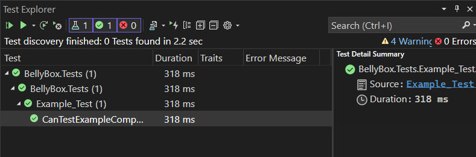
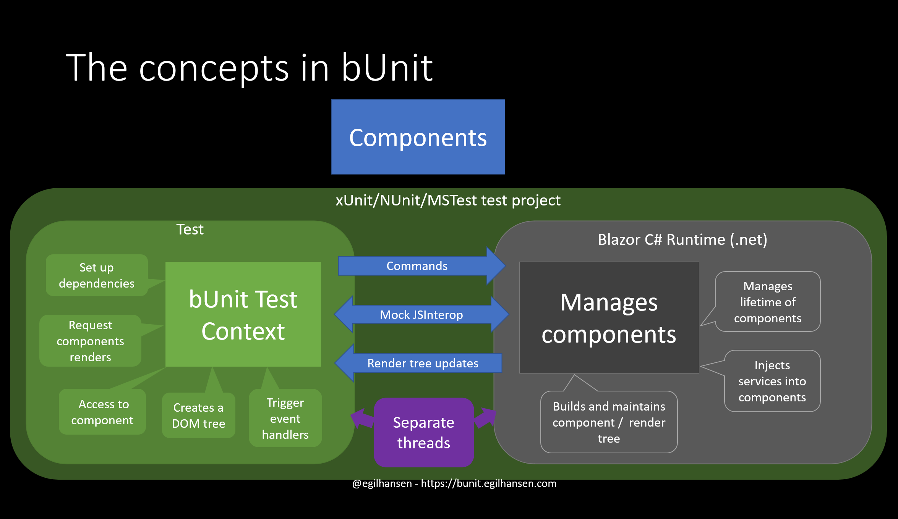
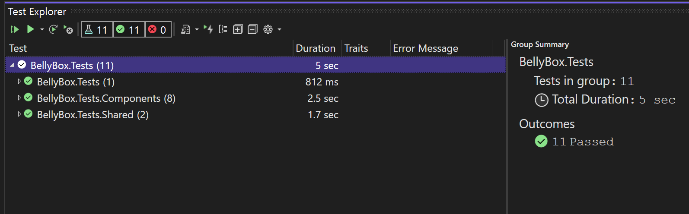
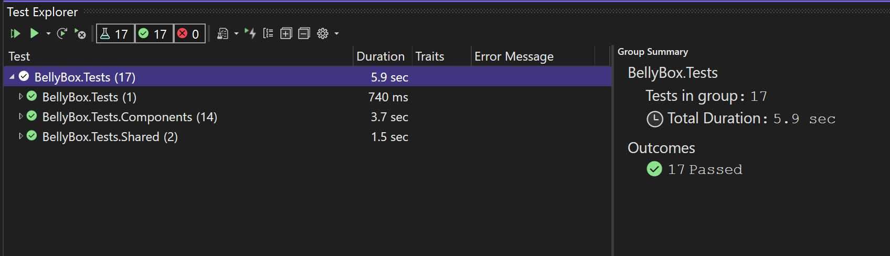
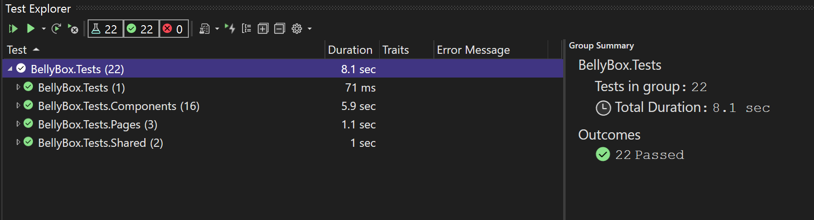

# Introduction

## 1.1 About the workshop
BellyBox is a startup founded by .NET engineers who have chosen the .NET platform to launch their new online grocery delivery application. The target customers are health-trend conscious and tech savvy and expect an intuitive experience when shopping online. As a new developer joining BellyBox, you will focus on the customer user interface (UI) portion of the application. Your task is to implement an elegant UI for directing customers through a highly customized food delivery program. Throughout the process, customers will choose from various food sensitivities, flavor profiles, and delivery schedules. You’ll also create a checkout experience which must be fully validated to avoid any possible errors with orders and shipping.

ASP.NET Core in .NET 6 provides the tools to build a modern full-stack application including front-end web applications using Blazor. With Blazor, developers can fully utilize the .NET ecosystem and C# language to build web applications without JavaScript and the associated tools. Because developers are leveraging existing .NET skills, the learning curve for Blazor is much shorter than what is experienced with JavaScript frameworks like Angular or React.

In this workshop, you’ll write unit tests to improve the reliability of a Blazor application. Using the bUnit test framework you’ll establish a red-green-refactor workflow. With this workflow component, markup and logic are isolated and tested without running the application in a browser. Next, you’ll isolate the components you’re testing from external variables by using mock services. At the end of this project you will have fully tested the application’s UI components with multiple tests to validate their functionality.

## 1.2 Techniques employed

The project will provide the core concepts for writing a wide range of unit tests.

Markup verification - Validating the initial markup that is rendered by a component is a valuable tool for quality control. Using markup testing you’ll reduce the need for running the application to perform manual tests in the browser.

Property binding verification - Using techniques in this project you’ll validate component data binding and asserting that components are handling parameter values as intended.

Data binding via services verification - When working with components that require external data or HTTP requests, you’ll use mock services to isolate the component logic and validate that data binding is working properly.

## 1.3 Project Outline

This workshop is divided into 4 milestones.

1. Creating a Blazor Test Project

    Add a unit test project to an existing solution.

2. Writing Component Tests with xUnit and bUnit

    Create unit tests that validate the operation of components.

3. Writing Component Tests with AutoData

    Utilize the AutoData library to simplify the writing of otherwise complex unit tests.

4. Writing Component Tests with Fakes and Mocks

    Utilize the Telerik JustMock library to work with expected errors and to isolate external dependencies through mocking.

## 1.4 Prerequisites

This series of workshop is meant for .NET developers who are looking to modernize their skills with Blazor. Learners who have no previous experience with .NET and C# may need additional learning resources before starting this project. The project focuses on the Blazor WebAssembly hosting model. To learn more about the nuances of Blazor WebAssembly and Blazor Server please refer to the Manning book “Blazor in Action by Chris Sainty” from the recommended resources below.

C# - Blazor uses C# instead of JavaScript for nearly all application logic. Familiarity with C# types, generics, namespaces, and loops is a must before starting this project.

.NET – Blazor predominantly uses the .NET ecosystem and NuGet dependencies . Developers who have only worked with JavaScript may need additional learning resources not covered in this workshop to be successful.

.NET SDKs – Developers should be familiar with installing the latest .NET SDKs. Concepts covered in the project make use of .NET 6.0 and ASP.NET Core in .NET 6. Install the latest version of .NET 6

Visual Studio (or VS Mac, VS Code, JetBrains Rider) – Visual Studio on Windows is the recommended tool for developing Blazor applications because of its ease of use. While other editors will work, they may require additional steps not covered in the workshop. Visual Studio for Mac, Visual Studio Code, and JetBrains Rider are acceptable alternatives. Install Visual Studio 2022, Community, Professional, or Enterprise

HTML – Learners are expected to be familiar with basic HTML tags and attributes. Instruction will be provided for features that are not considered common knowledge.

CSS – Learners are expected to be familiar with basic CSS selectors and values. Instruction will be provided when more advanced concepts are covered.

Git - Familiarity with basic Git/GitHub commands and techniques such as: clone, fork, checkout, and commit.

Enthusiasm for solving problems and self-led learning will also prove quite useful (and not just in this workshop)!

## 1.5 Libraries & Tools

A project specific GitHub repo will be used to fetch source materials including a starter application with web services and database. If you have completed the first project in this series, Simple App with WebAssembly, you may continue with the application you’ve created.

 - bUnit
   - Unit is a testing library for Blazor Components.

 - xUnit.net
   - xUnit testing tool for the .NET.

 - Telerik JustMock Lite
   - JustMock Lite is a free mocking framework that makes unit testing simpler.

 - AutoFixture
   -  AutoFixture is a library used to generate reliable test data.

 - LINQ
   -  Language Integrated Query (LINQ) is used to manipulate collections of data in the application.

 - Visual Studio (preferred)
   -  Visual Studio is the preferred code editor to use with this project.

 - VS Code
  - Visual Studio Code and the dotnet CLI (Command Line Interface) may be used as an alternative to Visual Studio.

## 1.6 Technology versions

| Technology | Minimum Version Required | Max Supported (Current) Version | 
|----------------|-----------------|-----------------|
| .NET SDK              | 6.0           | 6.0         |
| Visual Studio 2022    | 17.3.3        | 17.X        |
| xUnit.net             | 2.x           | 2.x         |
| xUnit.net             | 1.9.8         | (latest)    |  
| Telerik JustMock Lite | 2022.2.621.1  | (latest)    |
| AutoFixture.Xunit2    | 4.17          | 4.X(latest) |

## 1.7 Recommended resources

These resources, can directly impact or expand your understanding of the workshop's content. 
These resources do not need to be read in advance of starting the project.

  - Blazor in Action by Chris Sainty
    - Chapter 3 Working with Blazor’s component model
    - Chapter 11 Managing State

  - Code like a Pro in C# by Jort Rodenburg

  - Build Full-Stack Web Applications using C# and Blazor by Taurius Litvinavicius

We provide additional resources and tutorials throughout the project. Feel free to use any resources you can find to complete the project. If you run into problems or have questions, refer to the Frequently Asked Questions (FAQs) section.

## 1.8 Further reading

These are additional resources that may be helpful to further your understanding of the workshop's content. These resources may have excerpts in the project.

 - [Accessibility Test Driven Blazor Components](https://www.telerik.com/blogs/accessibility-test-driven-blazor-components)
 - [Microsoft Blazor Documentation](https://learn.microsoft.com/en-us/aspnet/core/blazor/?view=aspnetcore-6.0)
 - [bUnit Documentation](https://bunit.dev/docs/getting-started/index.html)
 - [Telerik JustMock Documentation](https://docs.telerik.com/devtools/justmock/introduction)
 - [Fluent Assertions Documentation](https://fluentassertions.com/introduction)

## 1.9 FAQs

<p><h3>Troubleshooting: Why don’t my unit tests show in the Test Explorer window?</h3></p>
<p>Unit tests must be public and be preceded by <code>[Fact]</code> or <code>[Theory]</code> before they’re visible in the test runner.</p>

<p><h3>What file type do I use to write bUnit tests?</h3></p>
<p>Unlike other .NET test frameworks, bUnit tests make use of <code>.razor</code> components or <code>.cs</code> files. Tests are often written in <code>@code</code> blocks of <code>.razor</code> files so HTML can easily be described with the Razor syntax. In this workshop we will be using the Razor syntax.</p>

<p><h3>What is a TestContext and why do we inherit from it?</h3></p>
<p>TestContext test context is a factory that makes it possible to create components under tests. This class also exposes methods for rendering our components.</p>

<p><h3>What is Arrange, Act, Assert?</h3></p>
<p>bUnit tests commonly follow the pattern below.</p>

```md
// Arrange
var cut = Render(@<Component />);
// Act 
... (as needed)
// Assert
cut.MarkupMatches(@<div>...</div>);
```

---

# Creating a Blazor test project 

## 2.1 Objective

Create and configure a new Blazor Test project.

## 2.2 Importance to project

This workflow is common practice for creating unit tests for Blazor components.
You will learn how to use xUnit and bUnit to write a component under test (cut) using Render and learn how to assert with MarkupMatches. These are fundamentals we will use in the next milestones.

## 2.3 Workflow

If you have not done so already, download the BellyBox project from this [repository](assets/simple-app-with-webassembly-ms5-full.zip).

1. In the BellyBox solution, create a new test project. Use the xUnit Test Project C# template. The new project should be named BellyBox.Tests and use .NET 6.0 as the Framework. 
  - Remove the file UnitTest1.cs.

<details>
<summary>Tip</summary>
<div class="tip" data-title="Tip">

> Use the Solution Explorer’s Add > New Project context menu in Visual Studio, or enter dotnet new on the command line.

</div>
</details>

2. Add the bUnit library to the test project. Install the bUnit NuGet package. Enable Razor in the project by updating the .csproj file’s SDK to <code>Sdk="Microsoft.NET.Sdk.Razor"</code>.

  - Install the Fluent Assertions NuGet package.
  - Add an <code>_Imports.razor</code> file to the project. Clear the contents and add the following using statements.

```md
@using Microsoft.AspNetCore.Components.Forms
@using Microsoft.AspNetCore.Components.Web
@using Microsoft.AspNetCore.Components.Routing
@using Microsoft.JSInterop
@using Microsoft.Extensions.DependencyInjection
@using AngleSharp.Dom
@using Bunit
@using Bunit.TestDoubles
@using Xunit
@using FluentAssertions
@using BellyBox.Client.Components
```

<details>
<summary>Tip</summary>
<div class="tip" data-title="Tip">

> The <code>_Imports.razor</code> file acts as a global using statement for all files in that root.
> Please refer to the resources section for a link to full documentation on bUnit. The bUnit website is critical for completing this workshop.

</div>
</details>

3. Configure Dependencies on <code>BellyBox.Tests</code> by adding a project reference for <code>BellyBox.Client</code>.

<details>
<summary>Tip</summary>

<div class="tip" data-title="Tip">

> Right click the Dependencies node for the project in Visual Studio, or use the dotnet add reference command where appropriate.

</div>
</details>

4. Test the configuration by adding a unit test.
 - Add a basic Razor component to the project named <code>Example.razor</code>. Leave the component’s markup 

  `<h3>Example</h3>`

 This component is not a unit test, but an actual component we will test to verify our setup.

 - Add a unit test Razor component named Example_Test.razor. Remove all markup from the component leaving only the @code block. Above the code block inherit the TestContext base class. Then inside the code block add a public void named CanTestExampleComponent. Next, add a [Fact] attribute to the method.

 - Use the Render method to render the Example component as the component under test (cut). Then validate that the component’s markup `@<h3>Example</h3>` was rendered using the MarkupMatches method. This test will validate our setup by testing our Example component.

<div class="info" data-title="Note">

> <p>Unlike other .NET test frameworks, bUnit tests make use of .razor components or .cs files. Tests are often written in @code blocks of .razor files so HTML can easily be described with the Razor syntax.</p>
> <p>TestContext test context is a factory that makes it possible to create components under tests.</p>
> <p>Unit tests must be public and be preceded by [Fact] before they’re visible in the test runner.</p>

</div>

<details>
<summary>Tip</summary>

<div class="tip" data-title="Tip">

> bUnit tests commonly follow this pattern:
```md
// Arrange
var cut = Render(@<Component />);
// Act 
... (as needed)
// Assert
cut.MarkupMatches(@<div>...</div>);
```

</div>
</details>

5. Run the unit tests and validate that the test passed.

  

<details>
<summary>Solution</summary>
  
  Feeling stuck? Use as little or as much help as you need to reach the solution!
  If you are unable to complete the project, you can download the full solution here. We hope that before you do this you try your best to complete the project on your own.
  
  [Download Solution](assets/2.1-partial.zip)

</div>
</details>

---

## Write tests with xUnit and bUnit

### 3.1 Objective

  Create unit tests for low-level and layout components.

### 3.2 Importance to project

  - This workflow is common practice for creating unit tests for Blazor components with little or no interactive logic.
  - You will learn how to use FluentAssertions to write <code>Should().Be</code> assertions.
  - You will learn to use a Theory to supply a unit test with data.

### 3.3 Resources

Here are the resources for this workflow.

  

Additional resources

  - The [bUnit Documentation](https://bunit.dev/docs/getting-started/writing-tests.html?tabs=xunit) describes all scenarios used in the milestones.
  - The [Fluent Assertions Documentation](https://fluentassertions.com/introduction) outlines how to write assertions and their role in unit testing.

### 3.4 Workflow

1. Write a test for the Alert component’s rendering. Validate that the child content and all status values render.

   * In the test project, add a folder named <code>Components</code>. Then create a test inside it named <code>Alert_Tests.razor</code> and clear the default markup.
   * Inherit from the bUnit <code>TestContext</code>. Then create a method in the <code>@code</code> block named <code>AlertShouldRenderChildContent</code>, decorate the method with a <code>Fact</code> attribute, and set the attribute’s <coede>DisplayName</code> to something meaningful.
   * Use the TestContext’s <code>Render</code> method to render an alert component with the child content <code><span>Some Child Content</span></code> and set the rendered component to a variable named <code>cut</code> (component under test)
   * Call <code>MarkupMatches</code> on the cut variable and assert that the rendered markup matches the following.

   ```md
   <div class="info"><span>Some Child Content</span></div>
   ```

    * Run the unit test and validate that it passes.<br><br>

 2. Write a <code>Theory</code> test for the <code>Alert</code> component that validates all <code>AlertStatus</code> values.

    * In the <code>Alert_Tests</code> component, add a method named <code>AlertShouldRenderStatusClass</code>. Then decorate the method with a <code>Theory</code> attribute. Next, use the <code>InlineData</code> attribute to specify values for each <code>AlertStatus</code> and their expected result.
    * Finally update the method to accept arguments for the status and expected status.
    * Render the <code>Alert</code> component as the <code>cut</code>, set the <code>Status</code> using the values passed from the <code>InlineData</code>.
    *  Use bUnit to <code>Find</code> the the rendered <code>div</code> element, then use <code>GetAttribute</code> to get the value from the class attribute. Next, assert that the value matches the expected status using the Fluent Assertions <code>.Should().Be(expected)</code> methods.
    *  Run the unit test and validate that it passes. <br><br>


3. Using what you’ve learned so far, write two tests for the <code>Pill</code> component using <code>Render</code>, <code>MarkupMatches</code>, and <code>Find/GetAttribute</code>.

    * Validate the <code>Pill</code> renders properly with a text value with <code>MarkupMatches</code>.
    * Validate that the <code>Color</code> property produces a style attribute with the correct value.
    * Run the unit tests and validate they pass. <br><br>


4. Write two tests for <code>MealListViewNoRecords</code> to validate that the component renders correctly with the <code>Show</code> property set. Inspect the <code>MealListViewNoRecords</code> component and think of what elements need test coverage. Note that the rendered markup for <code>Alert</code> has already been thoroughly covered.

    * Render a <code>cut</code> and set the <code>Show</code> parameter to <code>true</code>. Then use <code>MarkupMatches</code> to assert the correct markup is rendered.
    * For the second test, render a <code>cut</code> and set the <code>Show</code> parameter to <code>false</code>. Then use <code>MarkupMatches</code> to assert the correct markup is rendered.
    * Run the unit test and validate that it passes.


<div class="info" data-title="Note">

> <p>Unlike other .NET test frameworks, bUnit test make use of .razor components or .cs files. Tests are often written in @code blocks of .razor files so HTML can easily be described with the Razor syntax.</p>
> <p>TestContext is a factory that makes it possible to create components under tests.</p>
> <p>Unit tests must be <code>public</code> and be preceded by <code>[Fact]</code> or <code>[Theory]</code> before they’re visible in the test runner.</p>
</div>
</details>

<details>
<summary>Tip</summary>
<div class="tip" data-title="Tip">

> bUnit tests commonly follow this pattern:
```md
// Arrange
var cut = Render(@<Component />);
// Act 
... (as needed)
// Assert
cut.MarkupMatches(@<div>...</div>);
```
</div>
</details>

<details>
<summary>Tip on points 2-4</summary>
<div class="tip" data-title="Tip">

> <p>If a component is not found by the test project then it is likely you need a @using directive. This can be added to the individual test or to _Imports.razor.</p>
> <p>The <code>[Theory]</code> attribute creates a parameterized test with a subset of data. Data can be supplied in a many formats, but the most common is with an <code>[InlineData]</code> attribute.</p>
> <p>Values passed with <code>[InlineData]</code> are used as the parameters for the test method. The order of the parameters in the attribute match the order in which they’re required for the test method, with the last parameter being the expected value.</p>

</div>
</details>
<br>

5. Write a test for <code>NavMenu</code> to validate that the component renders correctly. In the test project add a folder named <code>Shared</code> then create a unit test in the <code>Shared</code> folder.

    * <p>Use MarkupMatches to validate that the <code>NavMenu</code> is rendered correctly. Since the <code>NavLink</code> is included with .NET, you can assume that the component is already tested. It can be included in the expected markup as a component, for example, <code><NavLink...></code>.</p>
    * <p>Run the unit test and validate that it passes.</p>

<details>
<summary>Tip</summary>
<div class="tip" data-title="Tip">

> Some components will have overlapping tests or can be considered tested by third parties. If there’s no need to validate a child component’s markup it can be declared using a component instance. When the component instance is used in this way it will simply generate the same HTML for both the actual and expected values.

```md
<li>
    <NavLink ...parameters
        Home
    </NavLink>
</li>
```

</div>
</details><br>

6. Write a test to validate that <code>MainLayout</code> renders correctly. Ensure that the <code>Body</code> content renders in the correct location.

    * <p>Use the Render method to render the <code>MainLayout</code> component and set the <code>Body</code> inside the component using</p>

   ```md
   <Body><p>Body Content</p></Body>
   ```

    * Run the unit test and validate that it passes.<br><br>


<div class="info" data-title="Note">

> <p>Unlike other .NET test frameworks, bUnit test make use of .razor components or .cs files. Tests are often written in @code blocks of .razor files so HTML can easily be described with the Razor syntax.</p>
> <p>TestContext is a factory that makes it possible to create components under tests.</p>
> <p>Unit tests must be <code>public</code> and be preceded by <code>[Fact]</code> or <code>[Theory]</code> before they’re visible in the test runner.</p>
</div>
</details>

<details>
<summary>Tip</summary>
<div class="tip" data-title="Tip">

> bUnit tests commonly follow this pattern:
```md
// Arrange
var cut = Render(@<Component />);
// Act 
... (as needed)
// Assert
cut.MarkupMatches(@<div>...</div>);
```
</div>
</details>

<details>
<summary>Tip on point 6</summary>
<div class="tip" data-title="Tip">

> The <code>@Body</code> directive is inherited from <code>LayoutComponentBase</code>. In normal operation the body is rendered by convention. When writing a test we need to declare the <code><Body></code> tag explicitly.

```md
<!-- outer elements -->
    <Body>
        <!-- body content -->
    </Body>
<!-- outer elements -->
```

</div>
</details>

  

<details>
<summary>Solution</summary>
  
  Feeling stuck? Use as little or as much help as you need to reach the solution!
  If you are unable to complete the project, you can download the full solution here. We hope that before you do this you try your best to complete the project on your own.
  
  [Download Solution](assets/3.1-partial.zip)

</div>
</details>

---

## Write tests with AutoData

### 4.1 Objective

  Create unit tests for low-level and layout components.

### 4.2 Importance to project

  - This workflow is common practice for creating unit tests for Blazor components that use parameters and data binding.
  - You will learn to install <code>AutoFixture.Xunit2</code> and use the AutoData attribute.
  - You will learn to combine <code>AutoFixture</code>, <code>Theory</code> and <code>AutoData</code> to simplify testing.
  - You will learn to use bUnit’s <code>FindComponent</code> method and Instance property to assert property values.
  - You will learn to invoke component events with bUnit.

### 4.3 Resources

Additional resources

  - The [bUnit Documentation](https://bunit.dev/docs/getting-started/writing-tests.html?tabs=xunit) describes all scenarios used in the milestones.
  - The [Fluent Assertions Documentation](https://fluentassertions.com/introduction) outlines how to write assertions and their role in unit testing.
  - The [AutoFixture Cheat Sheet](https://github.com/AutoFixture/AutoFixture/wiki/Cheat-Sheet#autodata-theories) describes common uses for the AutoData theory.

### 4.4 Workflow

1. Write a test for the <code>Card</code> component using AutoFixture and the Theory and AutoData attributes.

    * <p>Add the <code>AutoFixture.Xunit2</code> NuGet package to the test project. AutoFixture is an open source library for .NET designed to minimize the ‘Arrange’ phase of your unit tests in order to maximize maintainability.</p>
    * <p>In the <code>Components</code> folder create and set up a test named <code>Card_Tests</code>. Then add a using statement for <code>AutoFixture.</code></p>
    * <p>Create a test method and decorate it with the <code>Theory</code> and <code>AutoData</code> attributes. Then add arguments to the method for <code>title, img, url and childContent</code>
    * <p>Next, render a <code>cut</code> with the <code>Card</code> component and set all of its parameters using the values passed in from the method arguments.</p>
    * <p>Use <code>MarkupMatches</code> to assert that the correct markup is rendered. Since we’re validating that the parameters output values in the correct location within the markup, it’s possible to use the Razor syntax and reference the values directly, for example, </p>

    ```md
    
    ```

    * <p>Run the unit test and validate that it passes.</p>

<details>
<summary>Tip</summary>
<div class="tip" data-title="Tip">

> <p>The NuGet Package Manager in Visual Studio can be used to install AutoFixture. Optionally the command line can be used: <code>dotnet add package AutoFixture.Xunit2.</code></p>
> <p>The <code>[Theory]</code> attribute can be combined with the <code>[AutoData]</code> attribute in a single statement <coee>[Theory, AutoData]</code>.</p>
> <p>When using <code>[AutoData]</code> the <code>[InlineData]</code> attribute is omitted.</p>
</div>
</details><br>

2. Write a test for the <code>MealCard</code> component using the Instance property from the cut.
    * <p>Use <code>AutoData</code> to generate data for the <code>Meal</code> instance required for the <code>MealCard</code> to render.</p>
    * <p>Since there is test coverage already in <code>Card_Tests</code> that validates the component’s markup <code>MarkupMatches</code> is not needed. Instead, we’ll validate that the data is correctly assigned by the <code>MealCard</code>. Use the <code>cut</code>'s <code>FindComponent<></code> method to locate the internal <code>Card</code> component. Next, reference the current instance using the <code>Instance</code> property. Then validate the instance’s properties with the <code>Should().Be()</code> assertion.</p>
    * <p>Validate the internal <code>TagList</code> by finding the component, then use the <code>Instance</code> property and verify the <code>Tags</code> collection with the <code>.Should().BeEquivalentTo();</code> assertion.</p>
    * <p> Run the unit test and validate that it passes.</p>
    <br>

3. Write two tests for the <code>TagList</code> component.
    * <p>Create a Fact-based test method to render a <code>TagList</code> component with an empty <code>List<Tag></code>. Then use the <code>Render</code> and <code>MarkupMatches</code> to validate the markup.</p>
    * <p> Create a Theory-based test method. Then use <code>AutoData</code> to generate a <code>List<Tag></code> for the <code>Tags</code> property and render the tags list as the <code>cut</code>. Next, use the <code>FindComponents</code> method to locate all <code>Pill</code> components and assert their <code>Text</code> property is bound using the <code>Should().BeEquivalentTo()</code> assertion.</p>
    * <p> Run the unit tests and validate that they pass.</p>
    <br>

4. Write a test for the <code>TagsFilter</code>. Use AutoData to generate a <code>List<Tag></code> for the <code>Tags</code> property and render the <code>TagsFilter</code> component as the cut.
    * <p> Use the <code>FindAll</code> method to get all the list items from the <code>cut</code> using a a <code>child</code> combinator selector for the parent and child <code>ul > li</code>. Next validate that the count matches the number of items bound to the component.</p>
    * <p>Use <code>MarkupMatches</code> by writing a <code>for</code> loop to iterate over the collection of elements returned by <code>FindAll</code> and validate that each element is rendered correctly.</p>
    * <p>Run the unit test and validate that it passes.</p>

<details>
<summary>Tip</summary>
<div class="tip" data-title="Tip">

> bUnit’s <code>Find</code> and <code>FindAll</code> methods take an element selector. This selector can use a <code>child combinator</code> selector to find elements. The <code>child combinator looks</code> for relationships such as <code>parent > child</code>.
</div>
</details><br>

5. Write a second test for the <code>TagsFilter</code>. Use <code>AutoData</code> to generate a <code>List<Tag></code> for the <code>Tags</code> property and render the <code>TagsFilter</code> component as the <code>cut</code>.
    * <p>Create an empty <code>List<Tag></code> named selected and use the <code>@bind-SelectedFilters</code> directive to two-way data bind the empty list.
    * <p>Use the <code>Find</code> method to select the first <code>input</code> element and trigger a <code>Change</code> event. The <code>Change</code> event argument should be a <code>new()</code> instance.
    * <p>Validate that the selected item was changed by comparing <code>selected</code> with the item generated by <code>AutoData</code>.
    * <p>Run the unit test and validate that it passes.

<div class="info" data-title="Note">

> <p>Unlike other .NET test frameworks, bUnit test make use of .razor components or .cs files. Tests are often written in @code blocks of .razor files so HTML can easily be described with the Razor syntax.</p>
> <p>TestContext is a factory that makes it possible to create components under tests.</p>
> <p>Unit tests must be <code>public</code> and be preceded by <code>[Fact]</code> or <code>[Theory]</code> before they’re visible in the test runner.</p>
</div>
</details>

<details>
<summary>Tip</summary>
<div class="tip" data-title="Tip">

> bUnit tests commonly follow this pattern:
```md
// Arrange
var cut = Render(@<Component />);
// Act 
... (as needed)
// Assert
cut.MarkupMatches(@<div>...</div>);
```
</div>
</details>

<details>
<summary>Tip on point 5</summary>
<div class="tip" data-title="Tip">

> bUnit can trigger UI events such as the <code>Change</code> event. The event is called on an element. Event arguments may be customized if needed or a default can be supplied. <code>cut.Find(selector).Change(new())</code>;

</div>
</details>

  

<details>
<summary>Solution</summary>
  
  Feeling stuck? Use as little or as much help as you need to reach the solution!
  If you are unable to complete the project, you can download the full solution here. We hope that before you do this you try your best to complete the project on your own.
  
  [Download Solution](assets/4.1-partial.zip)

</div>
</details>

---

## Write tests with Fake and Mocks

### 5.1 Objective

  Create unit tests for components that depend on external data.

### 5.2 Importance to project

  - This workflow is common practice for creating unit tests for Blazor components that use parameters and data binding.
  - You will learn to install <code>AutoFixture.Xunit2</code> and use the AutoData attribute.
  - You will learn to combine <code>AutoFixture</code>, <code>Theory</code> and <code>AutoData</code> to simplify testing.
  - You will learn to use bUnit’s <code>FindComponent</code> method and Instance property to assert property values.
  - You will learn to invoke component events with bUnit.

### 5.3 Resources

Additional resources

  - The [bUnit Documentation](https://bunit.dev/docs/getting-started/writing-tests.html?tabs=xunit) describes all scenarios used in the milestones.
  - The [Fluent Assertions Documentation](https://fluentassertions.com/introduction) outlines how to write assertions and their role in unit testing.
  - The [JustMock Cheat Sheet](https://docs.telerik.com/devtools/justmock/cheat-sheet?utm_medium=referral&utm_source=ebook&utm_campaign=blazor-awareness-manning-blazor-book) describes common uses for the Telerik JustMock Lite framework.

### 5.4 Workflow

1. Write a test for the <code>MealListView</code> component’s empty state. In the <code>Components</code> folder create a test named <code>MealListView_Tests</code>.
    * <p>Add an empty <code>List<Meal></code> then render the cut with the <code>Data</code> property set to the empty list.</p>
    * <p>Use <code>MarkupMatches</code> to validate the <code>MealListView</code> displays the correct markup and <code>MealListViewNoRecords</code> component.</p>
    * <p>Run the unit test and validate that it passes.</p>

2. Create fakes to provide known test data to components. Add a folder named <code>Fakes</code> to the test project. In the folder add a static class named <code>MealViewData</code>.

    * <p>Add a static function named <code>GetFakeIngredients</code> that generates any number of <code>IEnumerable<Ingredient></code> and takes a number of records to generate. Set the values of each item’s properties to <code>Id = i</code> and <code>Name = $"Ingredient {n}-{i}"</code>, Ex: Name should return <code>"Ingredient 2-1"</code>.</p>
    * <p>Add a static function named <code>GetFakeTags</code> that returns <code>Tag[]</code> and takes a start and item count. Set the values of each item’s properties to <code>Id = i</code> and <code>Text = $"Tag {i}"</code>.</p>
    * <p>Add a static function named <code>GetFakeMeals</code> that takes a number of records to generate a <code>Meal[]</code>. Use the following template for the record’s properties.</p>

```md
Id = n,
Name = $"Meal {n}",
Calories = n,
Description = $"Meal {n} Description",
Servings = n,
ImageUrl = $"Image {n}",
ThumbnailUrl = $"TnImage {n}",
Tags = GetFakeTags(n, 2),
Ingredients = GetFakeIngredients(n)
```

<details>
<summary>Tip</summary>
<div class="tip" data-title="Tip">

> When creating a range of “fake” items, the Enumerable.Range method can be used to quickly generate data.

```md
public static Meal[] GetFakeMeals(int records) =>
    Enumerable.Range(1, records).Select(n => new Meal
    {
        ...
    }).ToArray();

```
</div>
</details>

3. Write a test for the MealListView component when populated with data. Use the MealViewData.GetFakeMeals to generate 3 meals. Then Render a <code>cut</code> using the generated data.

    * <p>Use <code>FindComponents</code> to reference the <code>MealCard</code> components. Validate the count is 3.</p>
    * <p>Use the <code>Instance</code> property of the rendered components to validate that all instances assigned to the <code>Item</code> parameter of the component are equivalent to the values set by the <code>Data</code> parameter. Use the <code>Should().BeEquivalentTo()</code> to make the assertion.</p>
    * <p>Run the unit test and validate that it passes.</p>

<details>
<summary>Tip</summary>
<div class="tip" data-title="Tip">

> When using bUnit’s <code>FindComponent</code> method, a component’s instance can be accessed via the <code>Instance</code> property.

```md
cut.FindComponent<Component>().Instance
```
> A component’s instance exposes the public properties of that instance. If the property is a collection the <code>Should().BeEquivalentTo(values)</code> assertion may be used. Using <code>BeEquivalentTo</code> will assert the structural equality of two object graphs.
</div>
</details>

4. Create an interface to abstract away <code>HttpClient</code> so components use a custom data service. In the <code>Client</code> application add a new class to <code>/Services</code> named <code>BellyBoxDataService</code>.

    * <p>Write a constructor to allow <code>HttpClient</code> to be injected into the service.</p>
    * <p>Add a method that returns a <code>Task< Meal[] ></code> named <code>GetMeals()</code>. Then migrate the <code>GetFromJsonAsync</code> code from <code>MealsList</code> into the service. Repeat the process by adding a <code>GetTags</code> service method.</p>
    * <p>Add a method that returns a <code>Task< Meal ></code> and takes an int named <code>GetMealById</code>. Then migrate the code from the try block of <code>MealDetail</code></p>
    * <p>Create an interface named <code>IBellyBoxDataService</code> that defines the methods used in the service <code>BellyBoxDataService</code>. Then update <code>MealsList</code> and <code>MealDetail</code> by replacing <code>HttpClient</code> with the interface <code>IBellyBoxDataService</code>. Finally, add the service <code>IBellyBoxDataService</code> to the service collection in <code>Program.cs</code> using the <code>AddScoped</code> method.</p>

<details>
<summary>Tip</summary>
<div class="tip" data-title="Tip">

> <p>To quickly create interfaces from a class, use the Visual Studio Extract interface] refactoring tool. 

> https://learn.microsoft.com/en-us/visualstudio/ide/reference/extract-interface?view=vs-2022

> Press Ctrl+. to trigger the Quick Actions and Refactorings menu and select Extract Interface from the Preview window popup.</p>
> <p>When using dependency injection in a service, the dependency is injected in the constructor of the class.</p>

```md
private readonly HttpClient _http;
public BellyBoxDataService(HttpClient http) ...
```
> To migrate code for the <code>BellyBoxDataService</code>, open the component and copy the http call from the right side of the <code>await</code> operator and move it to the service.
```md
_http.GetFromJsonAsync<Meal[]>("api/meals");
```
> When injecting an interface for a dependency use the <code>AddScoped</code> method.
```md
builder.Services.AddScoped<TService, TImplementation>();
```
</div>
</details>

5. Write a test for MealDetail using the Telerik JustMock Lite framework and fake data. Create a <code>Pages</code> folder in the test project. Add a test for <code>MealDetail</code> in the Pages folder.
    * <p>Add the <code>JustMock</code> NuGet package to the test project. JustMock Lite is a free mocking framework that makes unit testing simpler for testable projects.</p>
    * <p>Add a field for <code>IBellyBoxDataService</code>. Then create a constructor. In the constructor use <code>Mock.Create</code> to mock the service. Then add the service using <code>Services.AddSingleton</code>.</p>
    * <p>Add a test to validate the “not found” message. Use <code>Mock.Arrange</code> to cause <code>GetMealById</code> to throw an exception. Then use <code>Render</code> and <code>MarkupMatches</code> to validate the error is shown. Since the <code>Id</code> in this scenario doesn’t matter, we can use JustMock’s <code>Arg.AnyInt helper</code>.</p>
    * <p>Add a second test to validate that the component renders correctly with data. Use <code>AutoData</code> to generate a Meal instance. Then use <code>Mock.Arrange</code> to return the meal when <code>GetMealById</code> is called. Next, render the component and use <code>MarkupMatches</code> to validate the markup. If components are part of the rendered markup the component itself can be used since its rendering is covered by other tests.</p>
    * <p>Run the unit test and validate that it passes.</p>


<details>
<summary>Tip</summary>
<div class="tip" data-title="Tip">

> <p>When using Telerik Just Mock to create a mock, use <code>Mock.Create</code> with the type of service needed.</p>
```md
IService _service;

    public MyComponent_Tests()
    {
        _service = Mock.Create<IService>();
        ...
        Services.AddSingleton(_service);
    }
```
> <p>When arranging an <code>async</code> method, the return value should be created using <code>Task.FromResult(...)</code></p>
> <p>To arrange a method call on a mocked interface, use <code>Mock.Arrange</code>.</p>
```md
Mock.Arrange(() => _service.MethodToMock())
.Returns(Task.FromResult(fakeData));        
```
> Mocks can intentionally introduce errors to validate code paths that deal with error handling. Use the <code>Throws</code> method instead of <code>Returns</code> to throw an error.
```md
Mock.Arrange(() => _service.GetDataById(Arg.AnyInt))
        .Throws(new Exception());
```
</div>
</details>

6. Write a test for <code>MealsList</code> using JustMock and fake data.

    * <p>Add a field for <code>IBellyBoxDataService</code>. Then create a constructor that uses <code>Mock.Create</code> to mock the service.</p>
    * <p> Use <code>Mock.Arrange</code> to configure the service so <code>GetMeals</code> returns <code>MealViewData.GetFakeMeals(4)</code> and <code>GetTags</code> returns <code>MealViewData.GetFakeTags(1,5)</code>. Then add the service using <code>Services.AddSingleton</code>. Also add the <code>MealsListState</code> service.</p>
    * <p>Add a test method. Then validate that the <code>TagsFilter</code> instance has 5 items. Also validate that <code>MealListView</code> has 4 items.</p>
    * <p>Validate that clicking filters produces the expected results. Use <code>Find</code> to locate <code>input[id=2]</code>, then use <code>Change</code> to invoke a change event. Assert that the Data property has 2 items. Repeat for <code>input[id=3]</code> and assert that Data has 1 item. Repeat for <code>input[id=4]</code> and assert that Data has 0 items.</p>
    * <p>Assert that the service method <code>GetMeals</code> was only called once using <code>Mock.Assert</code>. Then assert that the service method <code>GetTags</code> was only called once.</p>
    * <p>Run the unit test and validate that it passes.</p>


<details>
<summary>Tip</summary>
<div class="tip" data-title="Tip">

> To assert that a method has been called once, use the <code>Occurs.Once</code> method from JustMock as follows. <code>Mock.Assert(() => _service.MethodToMock(), Occurs.Once())</code>;
</div>
</details>

<div class="info" data-title="Note">

> Progress Software, the company that provides Telerik JustMock. While a commercial version with additional features is available, the version Telerik JustMock Lite used in this project is completely free.
> Egil Hansen, the creator of bUnit work closely with Progress Software and ensures Telerik JustMock Lite is compatible with bUnit. In addition, Progress Software is a proud sponsored supporter of bUnit.
</div>


  

<details>
<summary>Partial Solution</summary>
  
  Feeling stuck? Use as little or as much help as you need to reach the solution!
  Here is the partial solution for this milestone. Use it to develop your own full solution.
  
  [Download Partial Solution](assets/5.1-partial.zip)

</div>
</details>

<details>
<summary>Full Solution</summary>
  
  If you are unable to complete the project, you can download the full solution here. We hope that before you do this you try your best to complete the project on your own.
  
  [Download Full Solution](assets/5.1-full.zip)

</div>
</details>

---

## Summary

Workshop Conclusion

  * <p>The objective of this project was to understand the role of unit testing in Blazor applications. The exercises provided an understanding of how to create a Blazor test project. We also installed multiple tools that together create a rich testing environment for components. Through this project we also came to understand how and why components are broken into child components.</p>

  * <p>It is important to understand conceptually how components are tested using the bUnit framework. We learned the various methods that exist in bUnit to render markup, find elements, invoke events, and inspect component instances. Understanding how to utilize xUnit’s Fact and Theory style tests gave us insight on structuring tests for multiple scenarios. By writing tests for component rendering and data-bound components, we got a clear picture of how components should be rendered and how AutoFixture can be used to test data bound components quickly.</p>

  * <p>Knowing how to write unit tests for components that depend on external data gave us insight on how to mock interfaces using the Telerik JustMock framework. Mocking provided an intuitive way to isolate components from services, validate method calls, and invoke failure states to test for error scenarios. We combined mocking, fakes, and theories to produce robust tests with little configuration or code.</p>

  * <p>Knowing how to unit test adds a layer of quality assurance to an application. Once unit tests are written for an application, code changes can be made with confidence. Unit tests can be written first in a process known as test-driven development, or TDD; try this in future projects and see if it’s the right choice for your next application.</p>
