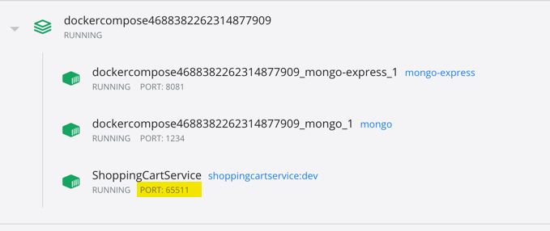

# Introduction

## 1.1 About the workshop
Writing unit tests is a big part of being a good software developer. Unfortunately, unit testing is far from trivial, and knowing how to use tools effectively is only part of writing effective unit tests.

You are an experienced C# developer, and you just arrived at your new job with eStore Connect, a company specializing in e-commerce solutions. You have been developing C# code for some time and have tried writing unit tests, but never got around to fully using automated tests as part of your development job. Your new company uses the latest and greatest technologies. You were told in your interview that they practice many Agile methodologies and rely heavily on automated tests from unit tests to acceptance tests to make sure that new code works as requested and to enable fast development cycles.

Your first job is to write unit tests for an existing ASP.NET Core microservice. It was created by another developer who is currently on vacation, so you are on your own.

Writing unit tests will help you understand how the code works and ensure that it works according to the requirements. Once we are done with unit tests, the rest of the system must be tested using integration tests. This is challenging because you will need to find a way to run a DB instance in a fast and predictable way, then initialize and clean it between the test runs.


## 1.2 Techniques employed

We will cover unit testing, integration testing, and test-driven development (TDD).

  - Upon completion, you will have the experience needed to write automated tests for your C# code using xUnit. A side benefit of this project is that by practicing, you will understand the power of automated tests in the development process.


## 1.3 Project Outline

This workshop is divided into four milestones. Each milestone builds upon the previous one and will teach you how to test existing functionality using unit and integration tests. As you advance through the project, keep in mind that the good tests are ones that have clear intent, and that writing tests according to best practices and guidelines is crucial. A good test will help you find issues and enable rapid development. A good test should only fail when there is a new bug in the system. So how you write tests is more important than how many tests you run. In every exercise try to think: Is this code readable? Will it continue working even if I change how the code is structured? And always try to test results and not implementation.

1. Write Unit Tests for Existing Non-Trivial Functionality Using xUnit

    We will start from an existing service. After running it to make sure our environment is configured correctly, we will analyze it to find where we can write unit tests (without using the DB). Then we will write those tests and run them from within Visual Studio. The tests will be written using unit testing best practices and patterns.
    Deliverable: The project given in the beginning of the workshop (a shopping cart microservice) with some of the functionality covered by unit tests
    Estimated duration: 2–4 hours

2. Use Parameterized Tests to Reduce Code Duplication and Increase Maintainability of Your Tests

    Continuing with the tests written in the previous milestone, we will refactor the tests using theories and the builder pattern in order to reduce test code and improve test maintainability.
    Deliverable: The project after the tests have been improved and refactored
    Estimated duration: 1–2 hours

3. Write Integration Tests for Code That Uses External Dependencies

    Writing integration tests is tricky. We need to make sure that they will not fail due to environment issues. We need to make sure that tests cannot affect each other. And we need to make our tests as simple as possible.
    Deliverable: The project given at the beginning of the workshop (a shopping cart microservice) tested completely with unit and integration tests
    Estimated duration: 2–3 hours

4. Add New Functionality Guided by Tests (TDD)

    Unit tests can be a powerful design tool. In this milestone, you will create new functionality using tests to create one requirement at a time and add new functionality to the existing service.
    Deliverable: The initial project with new functionality (coupons), created using TDD
    Estimated duration: 2–3 hours


## 1.4 Prerequisites

Our main development will be done using Visual Studio 2019. If you do not have Visual Studio installed, you can download and install the free Visual Studio Community edition from [Visual Studio Community](https://visualstudio.microsoft.com/vs/community/).

It is also possible to use VS Code instead, as long as you are familiar with it and can run and debug the tests and code supplied with this project.

In order to run the different projects you will need to have Docker installed as well. Installation depends on your OS of choice. I highly recommend downloading and installing Docker Desktop found at [Docker Desktop overview] (https://docs.docker.com/desktop/), and reading the Explore Docker Desktop page (https://docs.docker.com/desktop/use-desktop/) for a quick guide to Docker.

Throughout this project, we will use xUnit—a popular unit testing framework in the .NET world—to write and run our tests.

The init project will be available in the project folder.

## 1.5 Libraries & Tools

Libraries and setup

Our main development will be done using Visual Studio 2019. If you do not have Visual Studio installed, you can download and install the free Visual Studio Community edition from Visual Studio Community.

It is also possible to use VS Code instead, as long as you are familiar with it and can run and debug the tests and code supplied with this project.

In order to run the different projects you will need to have Docker installed as well. Installation depends on your OS of choice. I highly recommend downloading and installing Docker Desktop found at Docker Desktop overview, and reading the Explore Docker Desktop page for a quick guide to Docker.

Throughout this project, we will use xUnit—a popular unit testing framework in the .NET world—to write and run our tests.

The init project will be available in the project folder.


This workshop is for intermediate C# developers who want to gain experience with the different types of automated tests that they need to write as part of the software development process.

You will learn how to use tests to drive design, avoid regression, create a living document, and improve the quality of your code.

Although this workhshop requires good C# development skills, it does not assume any prior unit testing, TDD, or acceptance testing experience. If you are just starting to learn about unit tests or want to improve your skills, this project is for you.

In order to benefit from this project you must be able to read and write C# code. It is recommended that you have at least two years of experience developing C# code.

  TOOLS
  - Visual Studio: You should have work experience with Visual Studio and be able to create new projects and install plugins. When installing Visual Studio, make sure to install the following workloads:
  - ASP.NET and web development
  - .NET desktop development
  - .NET Core cross-platform development
    * It is also possible to use Visual Studio Code instead, as long as you have prior experience with developing .Net Core applications using VS Code.
  - MongoDB: You should have a basic familiarity with MongoDB. It will be used as the DB of the project.
  - Docker: You should have a basic understanding of Docker. You will need to be able to run Docker and Docker Compose files from Visual Studio. We will also use Docker to run needed dependencies in the tests.
  - .NET Core: Prior experience with ASP.NET Core is a plus, but not mandatory. We are going to create and test ASP.NET Core services. The services themselves will be supplied, so all you need to do is be able to read C# code and debug the services.
  - YAML: You should be able to read simple YAML files. It will help if you can understand the supplied Docker Compose file, but if you have never seen a YAML file before, don’t worry. It will be very basic, per our needs.
  - REST and HTTP: Since we’re going to use web services as the subject of our tests, basic familiarity with how REST and HTTP are used to create web services is required.

Enthusiasm for solving problems and self-led learning will also prove quite useful (and not just in this project)!

## 1.6 Technology versions

| Technology | Minimum Version Required | Max Supported (Current) Version | 
|----------------|-----------------|-----------------|
| .NET             | 	.NET 5  | .NET 7  |
| Visual Studio    | 2019     | 2022    |
| Docker Desktop   | -        | -       |


## 1.7 Upgrading projects to use .NET 6.0 or 7.0

.Net 6 is an LTS (Long Term Support) version of the .Net framework. .Net 6 will be supported by Microsoft for three years from its release. The previous version, .Net 5, is officially out of support from Microsoft but it can still be used for local projects for learning. You can upgrade the solutions in this liveProject from .Net 5.0 to .NET 6.0 (LTS) or .NET 7.0 (Current), by carrying out the following steps. You can substitute 7.0 for 6.0 throughout if you prefer the current version of the .NET framework.

  1. Upgrade the Target Framework
  * Open the solution in Visual Studio, right-click on the project file and select ‘Properties’ from the bottom of the context menu. Change the target framework to .NET 6.0 and save the project.
  * Alternatively you can edit the project’s .csproj file directly and change the target Framework from net5.0 to net6.0.

  2. Update the Docker Image
  * Open the file <code>Dockerfile</code>.
  * Change the base image from <code>mcr.microsoft.com/dotnet/aspnet:5.0-buster-slim</code> to <code>mcr.microsoft.com/dotnet/aspnet:6.0-bullseye-slim</code>.

You should now be able to run the project under .Net 6.0

Optional

Delete obj and bin folders to clean up old .Net 5.0 files

If you have any issues with the project not building or running, you may need to delete the existing bin and obj folders. You may also do this if you want to remove out-of-date files from your project. Go to the respective project directory and delete the ‘bin’ and ‘obj’ folders.

Additionally, you can delete the NuGet cache by running this command:

<code>dotnet nuget locals --clear all</code>

When you build the project the folders will be recreated and the project will be built using the new .Net 6.0 files.

## 1.8 Recommended resources

These resources, identified by the author, can directly impact or expand your understanding of the liveProject’s content. These resources do not need to be read in advance of starting the project.

  - Unit Testing Principles, Practices, and Patterns by Vladimir Khorikov
  - The Art of Unit Testing, Second Edition by Roy Osherove
  - Getting Started with xUnit.net

We provide additional resources and tutorials throughout the project. Feel free to use any resources you can find to complete the project. If you run into problems or have questions, refer to the Frequently Asked Questions (FAQs) section.

## 1.8 Further reading

These are additional resources that may be helpful to further your understanding of the workshop's content. These resources may have excerpts in the project.

 - Growing Object-Oriented Software, Guided by Tests by Steve Freeman and Nat Pryce

## 1.9 FAQs

<p><h3>What should I do if the Swagger page does not open?</h3></p>

In some cases debugging using docker-compose does not open the Swagger page automatically.

One solution is to go to Docker Desktop, see which port it is directed to (65511 in the image below), and then manually add the /swagger endpoint, for example, http://localhost:65511/swagger.

  

<p><h3>How do I know if I’ve finished refactoring my tests?</h3></p>

If the tests are short and to the point, and readable, then they are good enough.

Ask yourself, how much effort would I need to invest if someone added functionality to the code without changing the code I’ve already tested? Here are a few examples:

  - What would happen if a new parameter is added to the constructor?
  - What would happen if I needed to set all of the fields in the class under test?

<p><h3>I wrote my tests differently than the proposed solution.</h3></p>

If you have tested things differently than the proposed solution, or even consider some of the tests you wrote missing from the proposed solution, that’s OK. The proposed solution is only there as a guideline to show you how things are done. If your tests satisfy the coding guidelines and readability explained during this workshop, then they are good. Different people find different ways of testing things. If you have found a missing test, good for you! The reference solution is a good reference, but mistakes can happen, or else it was assumed you would understand how to write those tests based on your experience and the full solution.

<p><h3>How do I create Model Mapper for my testing?</h3></p>

Model Mapper is used to transform one type of object to another and is used in the tested project.

Some of the tested classes require Model Mapper to be initialized in order to work. Those classes have a constructor parameter of type IMapper.

Initializing Model Mapper is done using the following code:

```md
// Create IMapper as a member of the test class
private readonly IMapper _mapper;

// Use the class constructor to initialize IMapper
public CheckOutEngineUnitTests()
{
    var config = new MapperConfiguration(cfg => cfg.AddProfile(new MappingProfile()));

    _mapper = config.CreateMapper();
}

// Now you can pass IMapper to the class during a test
```

---

# Creating a Unit Tests for Existing Non-Trivial Functionality Using xUnit 

## 2.1 Objective

  - Add a new test project and write your first tests
  - Find code that can be tested in isolation
  - Write unit tests using xUnit

## 2.2 Importance to project
  - Writing good unit (and integration) tests is crucial to successful unit testing, from the name of the test to the test structure and using the correct assertions. All of those affect whether your tests will help you write better code, or break compilation and cause you to delete them in anger. A good test shows its intent, is focused, and makes it easy to understand why it fails. In this first milestone, we will create the basis on which we will build our whole automated testing strategy.
  - Try simple and trivial tests. Don’t worry if the test looks bad; we are going to fix that in the next milestone.

Note: You do not need to use a mocking framework as part of writing tests. 

## 2.3 Workflow

Download the provided microservice project that contains the logic for managing a shopping cart.

  - Make sure you can run and debug the provided solution.
   - Before starting make sure Docker is running.
   - Change startup project to docker-compose.
   - Press F5. A Swagger page should open. You can use it to try to debug different operations.
   - You can also view the data inside your MongoDB at http://localhost:8081 using your web browser of choice.

If you have not done so already, download the starting project from this [repository](assets/P1_start_solution.zip).

1. Create a testing project.
    * <p>Create a new test project using the xUnit Test Project (.NET Core) template.</p>
    * <p>Add a project reference to the project you want to test.</p>
    * <p>Make sure that the test project is using the same .NET version and framework as the service.</p>

2. Write unit tests for isolated functionality.
    * <p>Find the places in your code that you can run in a test without needing any installed dependencies, such as isolated, and write unit tests for those parts.</p>
    * <p>Only test logic. You do not need to test functions that do not have any functionality. Do not test classes such as InvalidInputException or Item or interfaces.</p>
    * <p> It is OK to duplicate test code, but if it feels like a lot of work right now, don’t worry. We’ll address duplicate test code in the next milestone.</P>
    * <p>If you are not sure which classes need to be tested, check the hints below in the help section.</p>
    * <p>If you have never written unit tests or used xUnit, read The anatomy of a unit test to learn about how to write unit tests using xUnit.</p>

    [The anatomy of a unit test](https://livebook.manning.com/book/unit-testing/chapter-3/point-10227-1-215-1) 

3. Run your unit tests and make sure they run successfully. Debug them to make sure they test the correct functionality.
    * <p>Running the tests can be done using the keyboard shortcuts (Ctrl + R, A) or from the test explorer window, located in the Test menu.</p>

<div class="info" data-title="General Hints">

> - <p>Writing unit tests is only half the work. You need to name your tests correctly, write them in the right place, and use specific structure for your tests.</p>
> - <p>When using <code>Assert.Equal</code> (expected, actual) keep in mind that the value you expect is the leftmost value, and the value returned from the subject of the test is on the right. This will help you understand the failure messages.
> - <p>If you want to use Assert.Equal, you need to compare classes to make sure that <code>Equals</code> is overridden so that classes with the same values will be equal to one another.</p>
> - <p>You do not need to test the same functionality more than once. If you have already tested some functionality in test class X, you do not need to repeat the same test in test class Y.</p>
</div>

<details>
<summary>Workflow Tip</summary>
<div class="tip" data-title="Tip">

> <p>Step 1 Tip</p>
> [Getting Started with xUnit.net](https://xunit.net/docs/getting-started/netcore/visual-studio) includes information on how to create xUnit test projects.

> <p>Step 2 Tip</p>
> Check the dependencies of your class to find the code that does not need the DB to run, such as ShippingCalculator.
> The classes you need to test (without external dependencies) are:

```md
CheckOutEngine
ShippingCalculator
AddressValidator
```

</div>
</details>

<details>
<summary>Resource Tip</summary>
<div class="tip" data-title="Tip">

> Unit Testing Principles, Practices, and Patterns by Vladimir Khorikov
>  - Chapter 3, “The anatomy of a unit test,” contains information on how to write readable tests.

> Unit Testing Principles, Practices, and Patterns by Vladimir Khorikov
>  - Chapter 3 section 1.1, “Using the AAA pattern,” is the ideal structure for a unit test.

> The Art of Unit Testing, Second Edition by Roy Osherove
>  - Chapter 8, “The pillars of good unit tests,” describes how to write a good unit test.

> The Art of Unit Testing, Second Edition by Roy Osherove
>  - Chapter 8 section 3.1, “Naming unit tests”

> Unit Testing Principles, Practices, and Patterns by Vladimir Khorikov
>  - Chapter 3 section 4, “Naming a unit test”

> Additional resources
  > - See the xUnit.net website for more information on how to write tests using xUnit.
  > - When naming your test you can choose one of two approaches. Both have good points on how to choose a test name, I usually choose the naming convention suggested by the first link of using <code>[MethodUnderTest][Scenario][ExpectedResult]</code> as I have been using it successfully for many years, but you should try either (or both) and decide for yourself.

</div>
</details>

<details>
<summary>Partial Solution</summary>
  
  Feeling stuck? Use as little or as much help as you need to reach the solution!
  Here is the partial solution for this milestone. Use it to develop your own full solution.
  
  [Download Partial Solution](assets/M1_solution_partial.zip)

</div>
</details>

<details>
<summary>Full Solution</summary>
  
  If you are unable to complete the project, you can download the full solution here. We hope that before you do this you try your best to complete the project on your own.
  
  [Download Full Solution](assets/M1_solution_full.zip)

</div>
</details>

---

# Parameterized Testing

## 3.1 Objective
  - Learn how to improve tests without compromising readability
  - Use parameterized tests to reduce duplication in test flow
  - Use the builder pattern to reduce code duplication in test data

## 3.2 Importance to project
   - Once you write more than one test, you will discover that there is quite a lot of code duplication between tests. This is fine to some extent because we are willing to sacrifice a little maintainability in order to create readable tests, but too much duplication can cause our test files to become an unreadable mess, with every change forcing us to update a few hundred tests. So it is important to learn how to use your unit testing framework and simple design patterns to help reduce duplication and create better, readable, and maintainable tests.

Note: You do not need to use a mocking framework as part of writing tests.

## 3.3 Workflow

1. Refactor the <code>ShippingCalculator</code> unit tests using parameterized tests.</p>
    * <p>Use the <code>Theory</code> annotation to reduce the number of tests needed.</p>
    * <p>Although you probably can write all of the tests as a single test, don’t. Think whether different tests belong together in the same flow.</p>
    * <p>Think about what would happen if the test fails. The more parameters you have in the test, the harder it would be to understand what went wrong.</p>
    * <p>Avoid writing logic inside your test. When using parameterized tests, it is easy to add conditions (for example, if/else) or similar constructs in your tests. This is a bad idea and would only create unreadable and unmaintainable tests.</p>
    * Read [Refactoring to parameterized tests](https://livebook.manning.com/book/unit-testing/chapter-3/point-10250-167-193-1) to learn more.

2. Create a method that creates cart instances used in tests.
    * <p>Since we need to create a cart object in most of our tests, we would like to have a single point in our code that is responsible for creating cart with minimal initialization.</p>
    * <p>Another option is to use the builder pattern instead.</p>


3. Create builder classes or methods (using the <code>Object Mother</code> pattern) for any other classes that are initialized in the system.
    * More information: [Reusing code in arrange sections](https://livebook.manning.com/book/unit-testing/chapter-10/point-10249-156-172-1)
    * More about the builder pattern implementation: [Test Data Builders in C# by Mark Seemann](https://blog.ploeh.dk/2017/08/15/test-data-builders-in-c/)

4. Refactor your tests to use the new builder classes.

5. Check the rest of your tests and use parameterized tests to reduce duplication where applicable.

<details>
<summary>Workflow Tip</summary>
<div class="tip" data-title="Tip">

> <p>Step 1 Tip</p>
> <p>Unit Testing Principles, Practices, and Patterns by Vladimir Khorikov</p>
> See chapter 3 section 5.1, “Generating data for parameterized tests.”
> - You will need two types of data for parameterized tests. Start with using <code>[InlineData]</code>. If you need to use logic or create objects at runtime, consider using <code>[[MemberData(…)]]</code>.

> <p>Step 2 & 3 Tip</p>
> Try to create builders/Object Mother for the main classes, such as cart, item, and address.

</div>
</details>

<details>
<summary>Resource Tip</summary>
<div class="tip" data-title="Tip">

> Unit Testing Principles, Practices, and Patterns by Vladimir Khorikov
 - Chapter 10 section 4.1, “Reusing code in arrange sections,” discusses using the builder pattern and Object Mother.

> Unit Testing Principles, Practices, and Patterns by Vladimir Khorikov
 - Chapter 3 section 5, “Refactoring to parameterized tests,” is on how to write and when to use parameterized tests.


</div>
</details>

<details>
<summary>Partial Solution</summary>
  
  Feeling stuck? Use as little or as much help as you need to reach the solution!
  Here is the partial solution for this milestone. Use it to develop your own full solution.
  
  [Download Partial Solution](assets/M2_solution_partial.zip)

</div>
</details>

<details>
<summary>Full Solution</summary>
  
  If you are unable to complete the project, you can download the full solution here. We hope that before you do this you try your best to complete the project on your own.
  
  [Download Full Solution](assets/M2_solution_full.zip)

</div>
</details>

---

# New Functionality with TDD

## 4.1 Objective
 - Learn how to use tests to design your code and drive implementation

## 4.2 Importance to project
- Test-driven development is a powerful methodology that helps us solve complex problems one step (one test) at a time. With it, you will create a flexible, decoupled solution that is easy to extend and change. When you write code using TDD, only write the code you need, and all of the code you write will be covered by tests.

## 4.3 Workflow

In this milestone we will add functionality to the service using TDD. In my experience, the hardest thing in TDD is to not jump ahead. Always focus on the task you’re solving. Don’t try to write the best code or write more than one test. Progress one step at a time and don’t read ahead.


<div class="info" data-title="Note">

> A TDD cycle has five stages:
> - Start by writing a failing test.
> - Run the test and make sure it fails for the right reason.
> - Write the minimum amount of code to make the test pass. It is OK to hardcode the solution or write a simplified version of the solution you think you need. Don’t worry about it (yet).
> - Run all the tests to make sure you have solved the problem and did not break existing functionality.
> - Refactor your code. Don’t add functionality. Just improve what you have written, then refactor your tests if you need to.
> - Start again with a new test.
</div>

 * <p>Throughout this exercise remember that each step should be finished before moving to the next one and that one step could consist of multiple TDD cycles (tests).</p>

 1. Add a new class for handling coupons called <code>CouponEngine</code>.
    * <p>Create a method public double <code>CalculateDiscount(CheckoutDto checkoutDto, Coupon coupon)</code>. The input of that class will be a <code>checkoutDto</code> and <code>Coupon</code> (new type). The output will be the discount amount (double) after applying that coupon.
    * <p>The first requirement you will implement is if coupon equals null return 0.
    * <p>Do not try to implement more than requested. In TDD we strive to implement the simplest solution possible.

2. Coupons can be for a specific amount. The coupon value will be absolute. In other words, if the coupon is for 10, then the calculated discount should return 10.
    * <p><b>First write a single test to implement this requirement, then implement using the simplest possible solution. Only afterward (and after refactoring) decide whether you need additional tests, then move to the next requirement below.</b></p>
    * <p>Coupon amount cannot be more than the total cart amount including shipping. If that is the case throw <code>InvalidCouponException</code> exception.
    Coupon amount cannot be a negative number.</p>

3. Coupons can be for a percentage of the total cost.
    * <p>The result should be equal to cart total * coupon value / 100.</p>
    * <p>The coupon value cannot be higher than 100.</p>
    * <p>The coupon value cannot be negative.</p>
    * <p><i>Did you have to write additional code to make your test pass? Why?</i></p>
    * <p><b>Stop and think. You might have a bug. If you can spot a bug, please write a test before continuing.</b> If you cannot spot the bug, check the help section for details</p>

4. Create a free shipping coupon.
    * <p>The result should be the cart shipping cost.</p>
    * <p>Before continuing, take a good look at the code you have created. Can you think of ways to refactor it? Think about how a creative PM can add functionality to your code.</p>

5. Add an expiration date to all coupons (one at a time).
    * <p>If the coupon expiration date has passed, throw <code>CouponExpiredException</code>.</p>
    * <p>For this step, you do not have to use TDD, but you can. Decide which method you feel more comfortable with.</p>

6. Create a new repository for coupons called CouponRepository. (See how ShoppingCartRepository was implemented for reference.)
    * <p>Don’t forget to create the test class CouponRepositoryIntegrationTests to write your new tests.</p>
    * Use TDD to implement the following:
     - Adding a new coupon to the coupon repository
     - FindById functionality
     - Delete functionality

7. Using TDD creates a new CouponController with the operations so that the user can manage coupons.
    * <p>Afterward try to run the new controller and test it.</p>
    * <p>Congratulations! You have created new functionality using tests. In the next project, we will discuss how to test the coupon integration with the shopping cart.</p>

<details>
<summary>Resource Tip</summary>
<div class="tip" data-title="Tip">

> The Art of Unit Testing, Second Edition by Roy Osherove
> - You can read more about TDD and see a short example in chapter 1 section 6, “Test-driven development.”

> Additional resources
> - [The day I understood TDD](https://helpercode.com/2010/04/06/the-day-i-understood-tdd/) is a short blog post explaining my experience with TDD.

</div>
</details>

<details>
<summary>Workflow Tip</summary>
<div class="tip" data-title="Tip">

> <p>Step 1 Hint</p>
> <p>The implementation for this requirement is quite simple:</p>

```md
public double CalculateDiscount(CheckoutDto checkout, Coupon coupon)
{
   return 0;
}
```
> <p>Step 2 Hint</p>
> <p>Testing for exceptions is done using Assert.Throws:</p>

```md
Assert.Throws<InvalidCouponException>(
      () => target.CalculateDiscount(CreateCheckOutDto(total: 10), new Coupon(20)));
```

> <p>Step 3 Hint</p>
> <p>Try writing the following test:</p>

```md
[Fact]
public void CalculateDiscount_CouponOfTypePercentageAndHigherThanAmount_DoNotThrowInvalidCouponException()
{
    var target = new CouponEngine();

    var actual = target.CalculateDiscount(CreateCheckOutDto(total: 10), new Coupon(50, CouponType.Percentage));

    Assert.Equal(5, actual);
}
```

</div>
</details>

<details>
<summary>Full Solution</summary>
  
  If you are unable to complete the project, you can download the full solution here. We hope that before you do this you try your best to complete the project on your own.
  
  [Download Full Solution](assets/M4_solution_full.zip)

</div>
</details>

---

## Summary

  <p>After writing unit and integration tests using xUnit for an existing project, you now know the following.</p>

  * It is easier to start writing your own fake objects, but they are harder to maintain.
  * Using a mocking/isolation framework will help you “extract” dependencies out of your test.
  * Using auto mocking will make your tests less fragile, as they no longer need to change when adding dependencies.

